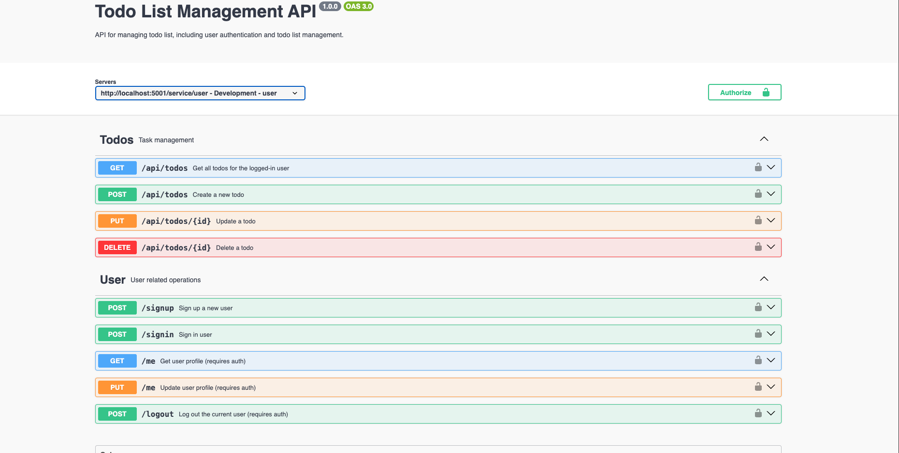

 WADS - To Do List

**Name:** Vammy Johannis Jiang

**Class:** L4CC

**Student ID:** 2702368122

### Cloning From GitHub
- Clone the repository and change directory to the respective repository
    ```text
    git clone https://github.com/TanaRuin/TodoApp-Forum-Week6.git
    cd TodoApp-Forum-Week6
    ```

- Installing all dependencies
    ```text
    npm install
    ```

- Run the application
    ```text
    npm run dev
    ```

<br>

### Pulling From Docker

- Pull the docker image from Docker Hub. You can see the public view of the docker repository [here](https://hub.docker.com/r/tanaruin/todoappwads).
    ```text
   docker pull tanaruin/todoappwads:latest
    ```

- Run the docker image.
    ```text
    docker run -p 5173:5173 tanaruin/todoappwads:latest
    ```

- You can now access the todo app in the link below.
    ```text
    http://localhost:5173/
    ```


<br>

### API EndPoint Design

